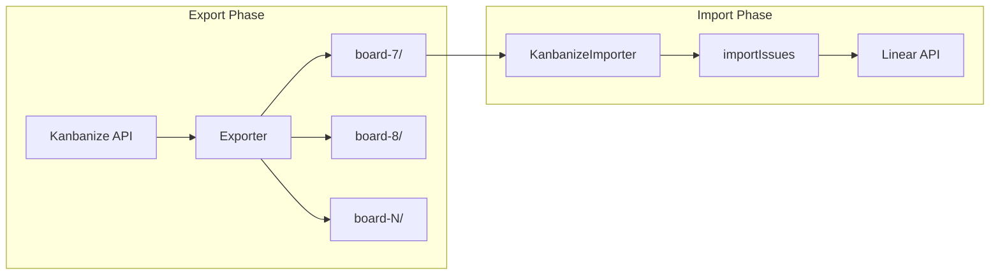

# Kanbanize to Linear Migration CLI

## Architecture Overview




## Part 1: Export Command

Creates JSON export files and downloads attachments from Kanbanize. **Supports exporting multiple boards to separate files** for backup purposes - not all exported boards need to be imported.

### Input Parameters

- `--board-ids` - Comma-separated list of Kanbanize board IDs to export (e.g., `7,8,10,13`)
- `--output-dir` - Base output directory (default: `./kanbanize-export`)
- Environment variable: `KANBANIZE_API_KEY`

### Output Structure

Each board is exported to its own subdirectory:

```javascript
kanbanize-export/
├── board-7/
│   ├── export.json          # Cards, comments, users, tags, columns, lanes for board 7
│   ├── metadata.json        # Board name, export timestamp, etc.
│   └── attachments/
│       └── {card_id}/
│           └── {attachment_id}_{filename}
├── board-8/
│   ├── export.json
│   ├── metadata.json
│   └── attachments/
│       └── ...
└── board-13/
    └── ...
```

The `metadata.json` contains:

```json
{
  "boardId": 7,
  "boardName": "Role: Backend",
  "workspaceId": 2,
  "workspaceName": "Engineering",
  "exportedAt": "2025-01-15T10:30:00Z",
  "cardCount": 150,
  "version": "1.0"
}
```


### Export Data Schema (`export.json`)

```typescript
interface KanbanizeBoardExport {
  // Reference data
  users: Record<number, KanbanizeUser>;
  tags: Record<number, KanbanizeTag>;
  columns: Record<number, KanbanizeColumn>;
  lanes: Record<number, KanbanizeLane>;
  
  // Cards with their comments
  cards: KanbanizeCardWithComments[];
}

interface KanbanizeUser {
  user_id: number;
  username: string;
  email: string;
  realname: string;
  avatar?: string;
}

interface KanbanizeTag {
  tag_id: number;
  label: string;
  color: string;  // hex without #, e.g. "eceff1"
}

interface KanbanizeColumn {
  column_id: number;
  workflow_id: number;
  name: string;
  section: 1 | 2 | 3 | 4 | 5;  // 1=Backlog, 2=Requested, 3=Progress, 4=Done, 5=Archive
  position: number;
  parent_column_id: number | null;
  color: string;
}

interface KanbanizeLane {
  lane_id: number;
  workflow_id: number;
  name: string;
  position: number;
  parent_lane_id: number | null;
  color: string;
}

interface KanbanizeCardWithComments {
  // Card identity
  card_id: number;
  custom_id: string | null;
  board_id: number;
  workflow_id: number;
  
  // Content
  title: string;
  description: string;  // HTML format
  
  // Position
  column_id: number;
  lane_id: number;
  section: number;
  position: number;
  
  // Assignment
  owner_user_id: number | null;
  co_owner_ids: number[];
  
  // Metadata
  priority: 1 | 2 | 3 | 4 | null;  // 1=Critical, 2=High, 3=Average, 4=Low
  size: number | null;
  deadline: string | null;  // ISO 8601 datetime
  color: string;
  
  // Timestamps
  created_at: string;  // ISO 8601 datetime
  last_modified: string;
  first_start_time: string | null;
  first_end_time: string | null;
  
  // Tags
  tag_ids: number[];
  
  // Relations (links to other cards)
  linked_cards: Array<{
    card_id: number;
    link_type: "parent" | "child" | "predecessor" | "successor" | "relative";
  }>;
  
  // Attachments (file references stored locally)
  attachments: Array<{
    id: number;
    file_name: string;
    original_link: string;
    local_path: string;  // relative path in attachments/ directory
  }>;
  
  // Comments
  comments: KanbanizeComment[];
}

interface KanbanizeComment {
  comment_id: number;
  text: string;  // HTML format
  author_user_id: number;
  created_at: string;  // ISO 8601 datetime
  attachments: Array<{
    id: number;
    file_name: string;
    local_path: string;
  }>;
}
```


### Key Files to Create

1. **[`src/kanbanize/client.ts`](src/kanbanize/client.ts)** - Kanbanize API client

- Rate limiting handling (30 req/min default)
- Authentication via `KANBANIZE_API_KEY`
- Methods: `getCards`, `getCardComments`, `getUsers`, `getTags`, `getColumns`, `getLanes`, `downloadAttachment`

2. **[`src/kanbanize/types.ts`](src/kanbanize/types.ts)** - TypeScript types from OpenAPI spec

- `KanbanizeCard`, `KanbanizeComment`, `KanbanizeUser`, `KanbanizeTag`, `KanbanizeColumn`, `KanbanizeLane`
- `KanbanizeBoardExport` - structure of `export.json` (cards, comments, users, tags, columns, lanes)
- `KanbanizeBoardMetadata` - structure of `metadata.json` (board info, export timestamp)

3. **[`src/kanbanize/exporter.ts`](src/kanbanize/exporter.ts)** - Export orchestration

- Loop through each board ID provided
- For each board:
    - Fetch board metadata (name, workspace info)
    - Fetch all cards (with pagination)
    - Fetch comments for each card
    - Fetch reference data (users, tags, columns, lanes)
    - Download attachments to board-specific directory
    - Generate `export.json` and `metadata.json`
- Progress reporting per board

---

## Part 2: Import Command

Reads a **single board export** and imports to Linear using the existing importer infrastructure. Run multiple times to import different boards to different Linear teams.

### Input Parameters

- `--export-path` - Path to a specific board export directory (e.g., `./kanbanize-export/board-7`)
- `--swimlane-id` - Filter cards by swimlane (lane_id)
- `--sections` - Comma-separated list of sections to migrate (1=Backlog, 2=Requested, 3=Progress, 4=Done, 5=Archive)
- `--status-mapping` - Optional JSON file mapping column names to Linear status names
- Environment variable: `LINEAR_API_KEY`

### Key Files to Create

4. **[`src/importers/kanbanize/KanbanizeImporter.ts`](src/importers/kanbanize/KanbanizeImporter.ts)** - Implements `Importer` interface

- Load export.json
- Filter cards by swimlane and sections
- Convert to `ImportResult` format
- Handle HTML to Markdown conversion using `turndown` library
- Add ALL relations to description (parents, children, predecessors, successors, relatives)
- Mark each relation as *(migrated)* or *(not migrated)* based on filter criteria

5. **[`src/importers/kanbanize/index.ts`](src/importers/kanbanize/index.ts)** - Interactive prompts for import configuration
6. **[`src/utils/htmlToMarkdown.ts`](src/utils/htmlToMarkdown.ts)** - HTML to Markdown converter using `turndown`

---

## Part 3: CLI Entry Point

7. **[`src/kanbanize-cli.ts`](src/kanbanize-cli.ts)** - Main CLI with subcommands

- `kanbanize-migration export [options]`
- `kanbanize-migration import [options]`
- Uses `commander` for CLI argument parsing

---

## Data Mapping

| Kanbanize | Linear ||-----------|--------|| `title` | `title` || `description` (HTML) | `description` (Markdown) || `owner_user_id` | `assigneeId` || `priority` (1-4) | `priority` (1-4, direct mapping) || `deadline` | `dueDate` || `created_at` | `createdAt` || `first_start_time` | `startedAt` || `first_end_time` | `completedAt` || `column.section` | `status` type (backlog/started/completed) || `column.name` | `status` name || `tag_ids` → `tag.label` | `labels` || `comments` | `comments` (with HTML→MD conversion) || `attachments` | Uploaded via `replaceImagesInMarkdown` |

### Section to Status Type Mapping

- Section 1 (Backlog) → `backlog`
- Section 2 (Requested) → `unstarted`
- Section 3 (Progress) → `started`
- Section 4 (Done) → `completed`
- Section 5 (Archive) → `completed` + `archived: true`

---

## Handling Card Relations

Since the Linear importer doesn't support creating actual relations between issues, **all relations** must be documented in the issue description. This includes all relation types from Kanbanize:

- **Parent** (one-to-many)
- **Child** (many-to-one)
- **Predecessor** (one-to-many)
- **Successor** (many-to-one)
- **Relative** (many-to-many)

The description will include a "Relations" section at the end:

```markdown
---
**Relations from Kanbanize**

Parents:
- [Card Title](https://truvity.kanbanize.com/ctrl_board/X/cards/Y) *(migrated)*
- [Card Title](https://truvity.kanbanize.com/ctrl_board/X/cards/Z) *(not migrated)*

Children:
- [Card Title 1](https://truvity.kanbanize.com/ctrl_board/X/cards/A) *(migrated)*
- [Card Title 2](https://truvity.kanbanize.com/ctrl_board/X/cards/B) *(migrated)*

Predecessors:
- [Card Title](https://truvity.kanbanize.com/ctrl_board/X/cards/C) *(not migrated)*

Successors:
- [Card Title](https://truvity.kanbanize.com/ctrl_board/X/cards/D) *(migrated)*

Related:
- [Card Title](https://truvity.kanbanize.com/ctrl_board/X/cards/E) *(not migrated)*
---
```

Cards marked *(migrated)* are included in this import batch; cards marked *(not migrated)* were filtered out or belong to a different board.---

## Dependencies to Add

```json
{
  "turndown": "^7.1.2",
  "commander": "^11.0.0"
}


```